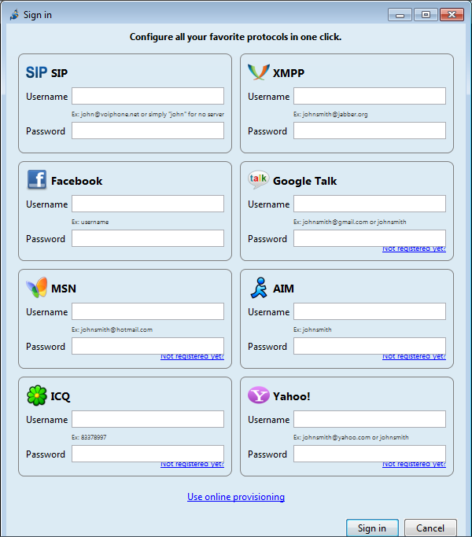
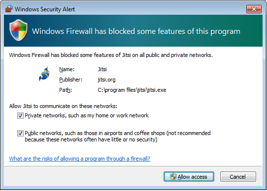

# Step 1: Download Jitsi
Download Jitsi through its [website](https://jitsi.org/Main/Download).
 
# Step 2: Open Jitsi
 Double click on the downloaded Jitsi file; the Open File - Security Warning dialogue box might appear. If it does, click on *"Run"* to activate the Windows Installer screen, followed by the *"Welcome to the Jitsi Setup Wizard"* window.
 
# Step 3: Agree to End User License Agreement
Click on **"Next"** to activate the "End User License Agreement" window; **check** the "I accept the terms in the License Agreement" option to enable the *Next* button, and then click on **"Next"** to activate the "Destination Folder" window.
 
# Step 4: Activate "Additional Tasks"
Click on **"Next"** to activate the "Additional Tasks" window and accept the default settings as presented.
 
**Note:** Enabling the Auto-start when computer restarts or reboots option may slow down the overall function of your computer, especially if you already have multiple applications configured to run when your computer starts up.
 
# Step 5: Install Jitsi
Click on **"Next"** to activate the "Ready to Install Jitsi" window, and then click on **"Install"** to activate the "Installing Jitsi" window displaying the installation progress bar.
 
# Step 6: Finish installation
Click on **"Finish"** to complete the installation process and automatically launch the "Jitsi Sign in" window as follows:

 
**Note:** In some instances, installing and launching Jitsi for the first time triggers a Windows Security Alert prompt screen. This alert is normal behaviour for the MS Windows operating system, it is ok to continue with using Jitsi.
 
Even if you do not click on any of the buttons, and simply close the prompt window, Jitsi is still able to communicate through Facebook Chat.

 
# Step 7: Authorise Jitsi
Select both Private and Public networks check-boxes, and then click Allow access to see the Jitsi Sign in window or main user interface window.
