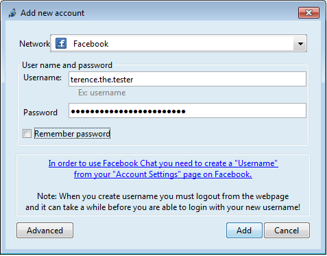

# Two settings to change
Facebook has two settings that you might need to change before Jitsi can connect to your Facebook Chat.
 
# Facebook Username
Facebook requires a username for Jitsi to connect to Facebook chat. Many Facebook users already have a username.
 
# Check your username
To check your username, log in to your Facebook account: your username is what appears in the location bar of your browser after https://www.facebook.com/ when you view your Timeline or Page.
 
# Other places you can find your username
Your username is also included in your Facebook email address (e.g. username@facebook.com).
 
# Other places you can find your username
You can get a new Facebook username by going to your Account Settings > General section or by visiting https://www.facebook.com/username.
 
# Verify your Facebook account
To set a new username Facebook might want to verify your account, which might require sending an SMS to a mobile phone number which you will need to provide to Facebook in the verification process.
 
# More questions?
For more details see Facebook’s explanation of usernames.
 
# App Settings
Facebook’s “application platform” needs to be turned on before Jitsi can connect to Facebook Chat.
 
# Turn "Apps you use" on
Visit your Facebook Account Settings > Apps section and check that the setting for “Apps you use” is turned “On”.
 
**Note:** Turning Facebook’s "application platform" on opens up much of your Facebook data to third-party application developers.
 
This data is available not only to the Facebook applications that you use, but also to the Facebook applications used by any of your friends.
 
# Hide personal information
After turning on Facebook’s "application platform", be sure to check the settings under "Apps others use". This allows you to hide some personal information from applications used by your friends.
 
# No setting for total privacy
Unfortunately, Facebook does not offer settings to hide all personal information.
 
# Determine privacy trade-off
Certain categories of information (like your friend list, gender, or info you have made public) are visible as long as Facebook’s "application platform" is turned "on". It is up to you to determine whether this is an acceptable trade-off.
 
# Add your Facebook account
Now you are prepared to add your Facebook account on Jitsi. To do this follow the steps below:
 
# Step 1: Add new Jitsi account
Select **File > Add New Account...** in the main menu bar of Jitsi.
 
# Step 2: Add new Facebook account
In the "Add New Account" dialogue, *Network* menu choose Facebook, enter your username and password and Click **"Add"**.

