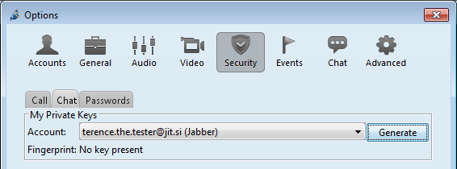
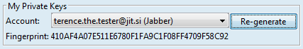
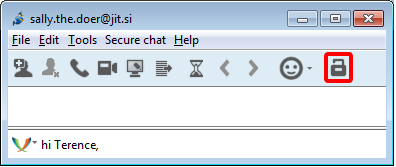
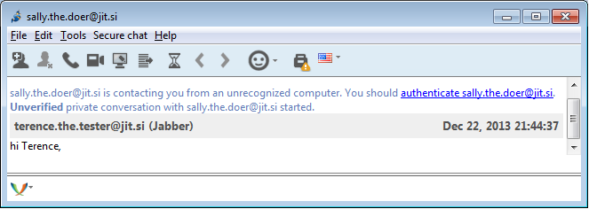
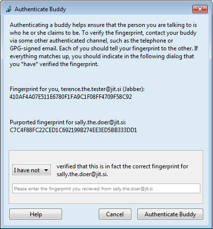
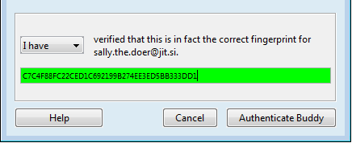
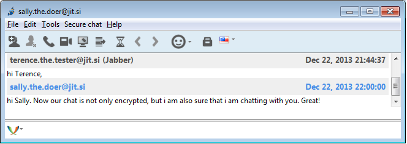

# Step 1: Open security settings
Select **Tools > Options** from the Jitsi menu and subsequently select the **Security** tab and its **Chat** sub-tab. You will then see a window similar to one shown in the image below:

 
# Step 2: Generate a key
Click on the **"Generate"** button. As a result you will see the fingerprint of the key that has been generated:

 
# One key per account
One key is generated for each account. You only need to do this again if you add a new account or install Jitsi on another device and do not move the existing keys to it.
 
# You are now ready to communicate
 
# Step 3: Open a new chat
Select a contact from the Jitsi main window and click on the *send message icon* (first from the left under the contact's name) to open a text chat window:

 
# Know when your chats are encrypted
Note the Encrypt chat with OTR icon, the open padlock on the right-top side of the window. This inconspicuous symbol informs you whether the chat is encrypted or not. Now the lock is open (there is a tiny space between handle and the body of the lock!).
 
# Step 4: Encrypt the chat
Click on the Encrypt chat with OTR icon. Note the changes in the window:

 
# Encryption is now on
Observe that the padlock is now locked. This means that whatever messages you and your contact send to each other are encrypted. Note the message that this is an unverified private conversation and that you should authenticate your contact.
 
# Step 5: Authenticate contact
Click on the link authenticate sally.the.doer@jit.si to open the Authenticate Buddy window:

 
# Compare your fingerprints
Note the message that encourages you to compare the fingerprints of vyour keys with your contact over another channel (not this text chat). In doing this, you can be more certain that you are communicating with your contact and not somebody else.
 
# Do so face to face
A good choice for key comparisons is to do it face to face, or via video or voice communication as these provide easier means to authenticate the identity of the other person.
 
# Verify the fingerprint
After you compare fingerprints, select the option I have verified the fingerprint from the pull-down menu and click on Authenticate Buddy:

 
# Return to chat
Closing the Authenticate Buddy window returns you to the chat window:

 
# Authentication verified
Note that padlock no longer includes the orange triangle with the white exclamation mark. This means that you have authenticated your contact.
 
# Only verify once per contact
The authentication should be done only once per contact. If the triangle with exclamation mark returns, it means that you are chatting to somebody who you have not yet authenticated.
 
# Re-authenticate contacts
This can happen when your contact moves to another device with another encryption key (another installation of Jitsi, or another OTR enabled program, etc.). In this case you will need to re-authenticate each other again to be sure of the identity of person with whom you communicate.
