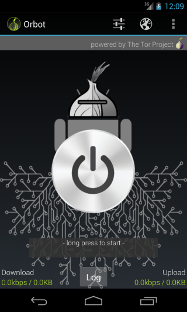
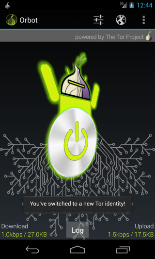

# Step 1: Start Orbot
Touch and hold the grey Orbot icon in the centre of the screen until it turns yellow and says Orbot is starting.

 
# Step 2: Confirm you have connected
The first time you start Orbot a notification will appear to confirm you connected successfully to the Tor network. Tap   to see the green Orbot indication that Orbot is running.

 
**Note:** You will only see the notification screen the first time you start Orbot after installation.
 
# Step 3: Disconnect
To disconnect Orbot you touch and hold the green Orbot until it turns grey. Or if you want to disconnect and quit Orbot, tap the menu icon () in the top right of the screen and select .

 
# Route your communication through Orbot
In order to browse or chat on the internet anonymously, you need to install an app (browser or chat) which can route your communication through a proxy in conjunction with Orbot.
 
Refer to the related guides Tactical Technology Collective has put together for using [Orweb](https://securityinabox.org/en/women-hrds/orweb/android) and [ChatSecure](https://securityinabox.org/en/women-hrds/chatsecure/android) with Orbot.
 
# Step 4: Create a new Orbot identity
If at any stage you want to appear to come from a new location, you can get a new identity from Orbot by swiping left or right on the green Orbot image.
 
# Recieve confirmation
The image will briefly spin and then display You've switched to a new Tor Identity.

