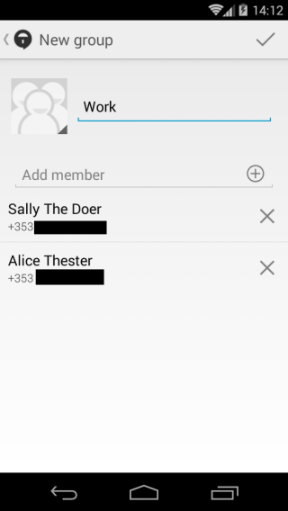

# Basics
Signal also allows you to message multiple people at once.
 
**Note:** If at least one of the people you are messaging does not use Signal, the messages will be sent as an MMS and not encrypted.
 
# Step 1: Create new group
Tap on the top right of your screen to bring up the menu and select "New group"
 
# Step 2: Name your group
Enter a name for your chat group and tap "+" to add your contacts.
 
# Step 3: Add contacts
Tap the box to the right of each contacts name to add them to the group and press the check mark
 

> Contact selection

 

> Group Creation

 
# Step 4: Complete group creation
Tap the checkmark to complete the creation of the group and be brought back to the Signal main screen.
 
# Step 5: Start messaging
Tap on the group you have created and begin messaging the group.
 

> Group conversation
