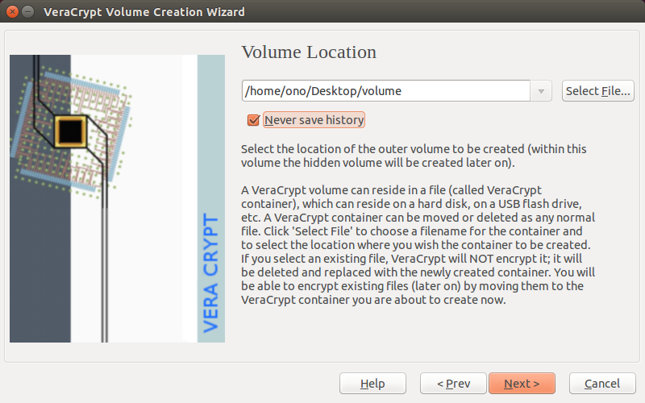
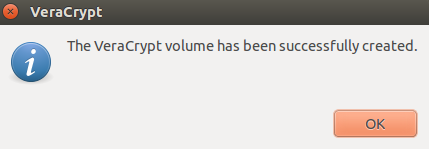

# Step 1. Open Veracrypt
Launch VeraCrypt to open the main application window

 
# Step 2. Begin the Volume Creation Wizard
Click [Create Volume] to activate the following VeraCrypt Volume Creation Wizard window

 
# Container files
A VeraCrypt container file is an encrypted volume that is stored within a single file. This container can be renamed, moved, copied or deleted like any other file.
 
# Step 3. Choose the type of volume to create
Click [Next] to select which type of volume you would like to create:

 
# Step 4. Choose a name and location
Make sure that Standard VeraCrypt Volume is selected and click [Next] to choose a name and location for your VeraCrypt container file.

 
# Step 5. Choose where your volume lives
Click [Select File…] to choose a location for your VeraCrypt container file and specify a name for it.

 
# Step 6. Find your encrypted volume
Navigate to the folder in which you would like to create your container
 
# Step 7. Name your encrypted volume
Choose a filename for your container and type it into the field at the top of the window
 
# Make sure it's a new name
Do not select a file that already exists! And be sure to remember where you put your container and what you call it.
 
# Remember where you save it
In this example, we created a container called volume on the Desktop, but your container can have any filename and any file extension.
 
# Be creative with names
For example, you can name your container recipes.docx or holidays.mpg in hopes that a casual observer will think it is a Microsoft Word document or a video file.
 
# Hidden in plain sight
This is one way you can help disguise the existence of a VeraCrypt container, but it will not work against someone with the time and resources to search your device thoroughly.
 
# USB storage devices
If you want to create a VeraCrypt container on a USB storage device, simply navigate to the device (rather than to a folder on your computer) before choosing a filename.
 
# Step 8. Save your encrypted volume
 Click [Save] once you have determined a location and chosen name for your VeraCrypt container file:

 
# Step 9. Configure your encryption Options
Click [Next] to configure your Encryption Options

 
# Step 10. Configure volume size
Click [Next] to select a volume size

 
# Specify size
The Volume Size window lets you specify the size of the container you are about to create. In this section, we will create a 250 MB volume, but you might want to specify a different size.
 
# Consider types of files
Consider the number of files — and, more importantly, the types of files — you intend to store in your encrypted volume. Image files and videos, in particular, can fill up a small VeraCrypt container very quickly.
 
# Saving to a CD
If you think you might want to backup your container file on a CD, you should choose a size that is 700 MB or less.
 
# Saving to a DVD
For a DVD backup, it should be 4.5 GB or less. If you intend to upload the container file to an online storage service, you will have to determine a reasonable size based on the speed of your Internet connection.
 
# Specify correct value
Type the size of the volume you would like to create. Make sure you select the correct value for KB (kilobytes), MB (megabytes), GB (gigabytes) or TB (terabytes).
 
# Step 12. Choose a passphrase
Click [Next] to choose a passphrase and refer to the [password lesson](topics/understand-4-digisec/2-passwords/1-1-intro.md) to learn how to do so safely

 
# Step 13. Enter your new passphrase
Type your passphrase and then re-type it into the Confirm field to activate the Next button.
 
#Step 14. Select filesystem type
Click [Next] to select a filesystem type

 
# Choosing appropriate type
The default value ("FAT") will work for most people and is compatible with Linux, Windows and Mac OS X computers. However, if you intend to store files that are larger than 4 GB (for a single file), then you will have to select a different Filesystem type.
 
# Consider relevant operating system
Linux Ext2 will only work on Linux computers, and NTFS will work on Windows computers and most Linux computers.
 
# Step 15. Add random data
Click [Next] after choosing an appropriate Filesystem type

 
# Creating random data
VeraCrypt is now ready to create a standard encrypted volume within a container file. If you move your mouse within the VeraCrypt Volume Creation Wizard window, it will produce random data that will help strengthen the encryption.
 
# Step 16. Create your standard volume
Click [Format] to begin creating your standard volume.
 
VeraCrypt will let you know when it has finished creating your encrypted volume.

 
# Step 17. Click [OK]

 
# Step 18. Close the VeraCrypt volume.
 
Click [Exit] to close the VeraCrypt Volume Creation Wizard and return to VeraCrypt's main window. (If you click [Next], VeraCrypt will begin walking you through the process of creating another encrypted volume.)
 
# Done!
You should now see your 250 MB container file in the location you chose in Step 6.
