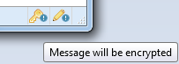

Once both you and your correspondent have successfully imported and validated and signed each other's public keys, you are ready to begin sending encrypted messages and decrypting received ones.
 
# Step 1. Open Thunderbird
Open Thunderbird and click  to write an email.
 
# Step 2. Turn on Force Encryption
To Encrypt the message click *Enigmail -> Message will not be encrypted* and select *Force Encryption* as shown in the follow screen:

 

# Step 3. Turn on Force Sign
To Sign the message click *Enigmail -> Message will not be signed* and select *Force Sign*.
 
**Note:** To verify that your message will be both encrypted and signed, check that the following two icons appear highlighted at the bottom right corner of the message pane as follows:

 
# Step 4. Send the message
Click  to send the message. You may be prompted for password to use your private key to sign the message.
 
# Step 5. (optional) Encrypt attachments
If you are attaching any file to your message, you may need to select the option Encrypt/sign message as a whole and send it using PGP/MIME and click OK button, in the following screen:

 
**Note:** When you encrypt each attachment separately, the names of the attached files are not encrypted and are being send in clear text! This may result in leaking sensitive information!
 

Using PGP/MIME ensures that all email text, attached files and their names are encrypted and hidden. Refer to the [metadata](topics/understand-4-digisec/3-metadata/1-1-intro.md) lesson to learn more about these dangers
